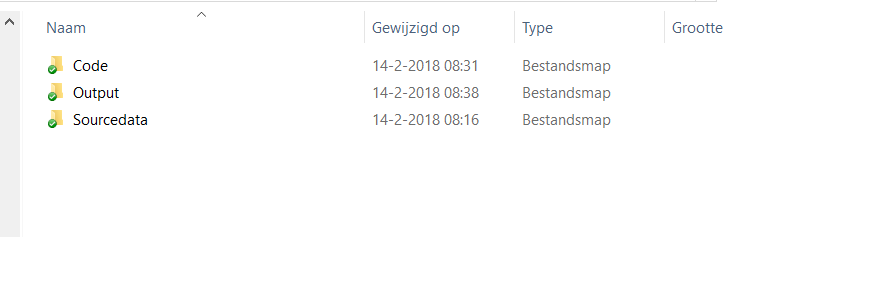

# Introduction

This course is about working with data. Often your data will be stored in _Excel_ files (with the extension _xls_ or _xlsx_) or in _csv_ (comma separated values) files (with extension _csv_). Note that _csv_ files can also be opened in _Excel_.

In this course we will teach you how to import data from _Excel_ and _csv_ files. However, in general, `R` can be used to open virtually any type of data file (e.g. _SPSS_ and _Stata_). Please use Google if you need to import data from other sources.

## Packages

```{r}
library(tidyverse)
library(readxl)
```

# Basic directory structure

It's very usefull to create a directory structure for your project with one folder with the name _Code_ (in which you will save your notebook), one folder with the name _Sourcedata_ (where we will save all the source data) and a folder named _Output_ (where we will save any output that we want to save).



In the following examples we assume that you have structured your directory structure as indicated.

# Read csv files

## Read and specify the path

We will start with reading the contents of the _csv_ file _football.csv_. This file contains data on the ranking of Dutch football teams in 2015 and 2016.

We will use the command `your_dataframe <- read.csv2("file_name.csv")`.
_your_dataframe_ is the name that you give to the dataframe. In this example we will call the dataframe _football_.

However, this only works if the data file is located in the same folder as the notebook. In this case we have saved our data in the folder _Sourcedata_ and the code in the folder _Code_. Therefore, we need to tell `R` where to find the datafile. 

We can include the path in parameter _file_name_. In this example we tell `R` to go 1 folder up ('..') and then go to the correct folder _Sourcedata_:

```{r}
football <- read.csv2("../Sourcedata/football.csv")
```

## Inspect the dataframe

We now have read the data. There are a few ways to inspect the data.
If we want to see the complete dataframe we can just type the name and hit enter:

```{r}
football
```

This may not be very practical if you have very large dataframes. With the command `head(name_dataframe)`, you can see the first rows of the dataframe,

```{r}
head(football)
```

while with `tail(name_dataframe)` you can see the last rows:

```{r}
tail(football)
```


With the command `summary(name_dataframe)`, you will get a summary of your dataset:

```{r}
summary(football)
```


## Common issue

We will now read another dataset containing information about the Dutch football league. For your convenience, we have downloaded the data and stored it in a _csv_ with the name _N1.csv_.

```{r}
football1 <- read.csv2("../Sourcedata/N1.csv")
```

If we have a look at the data, we see the following

```{r}
head(football1)
```


All the data are imported into a single column!

The extension _csv_ is an abbrevation of _Comma Separated Value_. When this format was developed, observations were separated by 'comma's'. In some countries, e.g. the Netherlands, values are commonly separated by ";".  `read.csv2` assumes that the values are separated by ';', so for most cases, it's more convenient to use. If you read a file where values are separated with ',', the command `read.csv2` does not recognize this. There are several ways to solve this issue. The most practical way is to specify the separator manually. In the case of the file _N1_,  a comma is used to separate the values:

```{r}
football2 <- read.csv2("../Sourcedata/N1.csv", sep = ",")
head(football2)
```

# Read Excel files

## Read Excel files

Often you will get your data in the form of an _Excel_ sheet. There are several packages available to read _Excel_ files in `R`. For this course, we will use the package `readxl`.

We will use the same data as above, only in a different format.
We have loaded the package `readxl` at the top of this notebook. using that package, the `Excel` sheet can be loaded by using:

```{r}
football_points <-read_xlsx("../Sourcedata/football.xlsx")
head(football_points)
```

Looking at the data, we see that the _Excel_ sheet is read in to a dataframe including empty rows and a name that is not necessary. We can repair this using the package `dplyr` (which we will use later in the course), but we can also use the command `skip()`. In this case we do not want to read the first 3 rows into our dataframe.

```{r}
football_points1 <-read_xlsx("../Sourcedata/football.xlsx", skip = 3)
head(football_points1)
```

## Read separate sheets

If you have opened the _Excel_ sheet, you might have noticed that it has two worksheets. We only read the first sheet, but we can also read the second worksheet:

```{r}
football_budget <-read_xlsx("../Sourcedata/football.xlsx", sheet = "Budgets", skip = 3)
head(football_budget)
```

Note: instead of `sheet = "Budgets"`, we could have used `sheet = 2`

```{r}
football_budget1 <-read_xlsx("../Sourcedata/football.xlsx", sheet = 2, skip = 3)
head(football_budget1)
```

Later today, we will show you how to merge the two data frames.

# Writing data

It is possible to write a dataframe as a _csv_ file by using the command `write.csv2()`. This is not often needed, because all the data editing is reproducible within the script. But sometimes you may want to write your dataframe as a _csv_ file and you can do that with:

```{r}
write.csv2(football, file = "../Output/Myfootballdata.csv")
```

Note that we write the file to the _Output_ directory as previously recommended.

# The structure of the dataset

In `R`, there are only a few common types of data:

* `character` (strings)
* `numeric` (real numbers)
* `integer` (integer numbers)
* `complex` (complexe numbers, e.g. 2+3i, not often used)
* `logical` (binary `TRUE` / `FALSE` and `NA`)
* `factors` (categorical data: e.g. _male_, _female_)

And with the command `str(name_dataframe)` you will get the structure of your dataframe

```{r}
str(football)
```

In this example we see that the variable "Club" is a factor and the variables "Points" and "Budgets" are integers.


## Change the structure of your dataframe

We can change the nature of the variables in several ways. Here we will show you a simple way (later we learn how to do this using the package `dplyr` (which is part of the larger package `tidyverse`)).

Suppose you want to change the variable _Club_ in to a string of characters and

```{r}
football$Club <- as.character(football$Club)
```

change the variable _Points_ into a new variable _Points_numeric_ which is a numeric vector:

```{r}
football$Points_numeric <- as.numeric(football$Points)
```

To check if our commands were succesfull:

```{r}
str(football)
```

You can now change the structure of all variables. There is one **Warning** however:

### Change factors into numerics

You cannot change a vector of `factors` directly into a vector of `numerics`, because `factors` internally use levels.  As an illustration we create a vector called _variable_factor_ with levels 3 and 4.

```{r}
variable_factor <- as.factor(c(3,3,3,3,3,4,4,4))
```

We can check the structure by the command `str()`

```{r}
str(variable_factor)
```

We will now directly change this factor in to a numerical vector ("variable_nume") and see what happens:

```{r}
variable_numeric_wrong <- as.numeric(variable_factor)
variable_numeric_wrong
```

R returns a vector of 1's and 2's, because a vector of factor is not a vector of numbers, but a vector with _levels_. To do this correctly we need to change the factor into a _character_ vector first and then into a _numeric_ vector:

```{r}
variable_numeric <- as.numeric(as.character(variable_factor))
variable_numeric
```
