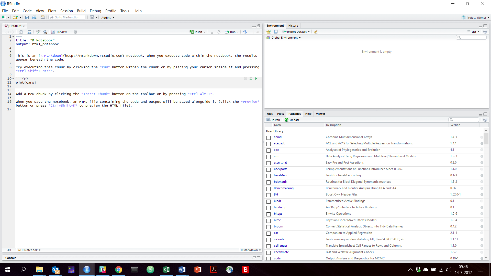

```{r setup, include=FALSE}
knitr::opts_chunk$set(echo = TRUE)
```

# Introduction

In stead of using the Jupyter notebook for the R part of the course, you may want to use R-studio. R-studio works in the same way with notebooks as Jupyter. It containts the possibility for Markdown text and cells with code. While the Jupyter notebooks work in your browser, R-Studio is just a "normal program". 
The R studio notebooks have the extension ".Rmd". If you save a Rmd-file, R-studio automatically generates a html-file. 


# How to Install R Studio
In order to run R and R-studio on your system, you need to follow the following three steps in the same order.

1. Install R
2. Install R-Studio
3. Install R-Packages 


## Install R

Please only follow this step in case you did not install R before.

Follow the steps below with respect to the operating system you are using
Please install the newest version (on top of the webpages)


### For Windows :
Download the binary setup file for R from the following link: [R for Windows](https://cran.r-project.org/bin/windows/base/)

Open the downloaded .exe file and Install R


### For Apple Mac :

Download the appropriate version of .pkg file form the following link. [R for Apple Mac](https://cran.r-project.org/bin/macosx/)

Open the downloaded .pkg file and Install R


### For Linux :
For complete R System installation in Linux, follow the instructions on [this link](https://cran.r-project.org/bin/linux/ubuntu/README)

For Ubuntu with Apt-get installed, execute sudo apt-get install r-base in terminal.


##  Install R Studio

To install R-studio please go to [this website](https://www.rstudio.com/products/rstudio/download/)

On this website you see a number of options. But only need the free version. So you can go to the bottom of the webpage.


On the bottom of the webpage you will find the installers for different plaforms. These platforms include Windows, Mac and Ubuntu. Please choose the one that fits your computer and run the installation.


## Install packages


When you open R-studio you will see this screen:


In the left panel we will open the notebooks. On the top-right panel you will see any dataframes you will make. 
On the bottom-right panel you will find the help function, but also the possibility to install packages.

If you click on the button "packages" you see to options: "install" and "update". If you want to install packages click on the "install button".

You only need the fill in the name of the package that you want to install in the white rectangle and press install.


# The use of notebooks in R studio

The most efficient way to work with notebooks in R-studio and Jupyter is to save your notebook and data in the same directory. Then you don't need to hard code paths.

If you open R studio you have this screen (same image as above):


## Start a new notebook

To start a new notebook go to "file"" in the topleft corner and choose "New File". Then choose "R notebook" (the second option).



As you can see the there is already an example. You can delete this. 
Hoewever, you see the that there is (Markdown) text and there are code blocks.

The default is that you use Markdown. If you want to have a piece of code, please click on "Insert" and choose "R".
I do not advise you to run Python in R-studio.

When you go to file you can save your notebook. 

When you press "Preview" you will the see the generated html file.


## Open a notebook

To open a notebook you go to "file" in the topleft corner and press open file and browse on your computer to the right directory.


